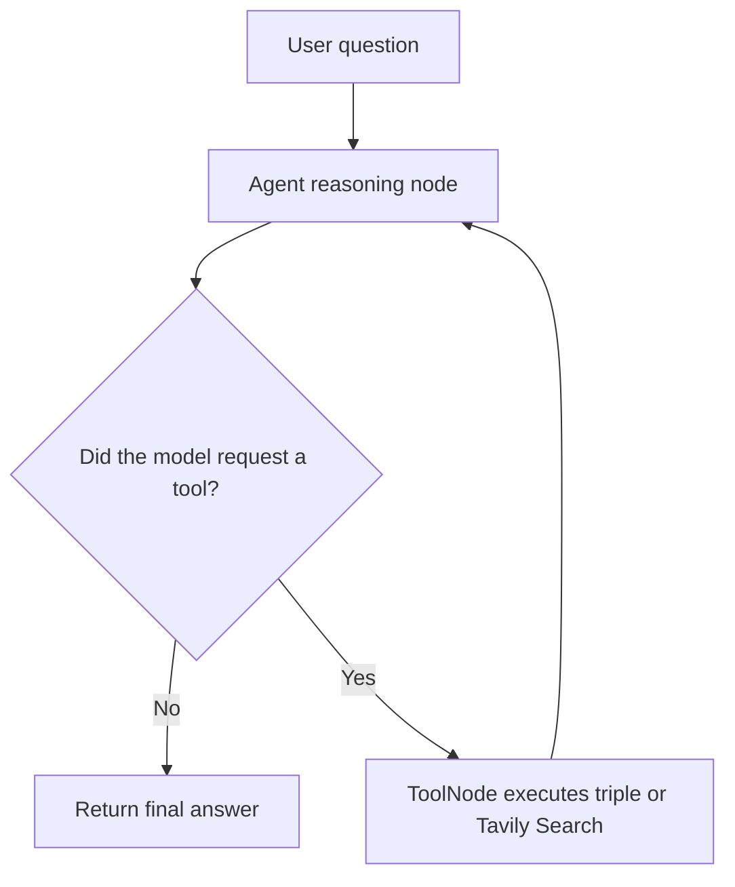

# Tavily Search ReAct Agent with LangGraph

This project is a small, practical example of building a tool-using AI agent with [LangGraph](https://langchain-ai.github.io/langgraph/), [LangChain](https://www.langchain.com/), OpenAI chat models, and Tavily Search.

The application receives a user question, lets the model decide whether it needs a tool, executes the selected tool, and sends the tool result back to the model. The loop continues until the model produces a final answer.

The default example asks:

> What is the temperature in Pune? List it and triple it.

This demonstrates two different capabilities in one run: Tavily supplies current search information and the local `triple` tool performs a deterministic calculation.

## What This Project Demonstrates

- Defining a custom LangChain tool with the `@tool` decorator.
- Connecting the Tavily Search tool to a chat model.
- Binding tools to `ChatOpenAI` so the model can request them.
- Representing an agent workflow as a LangGraph state graph.
- Passing messages between an agent reasoning node and a tool execution node.
- Routing conditionally based on whether the latest model message contains tool calls.
- Loading secrets from a local `.env` file without committing them to Git.

## Project Structure

| File | Purpose |
| --- | --- |
| `main.py` | Builds and runs the LangGraph workflow. It also decides whether to continue to tool execution or finish. |
| `nodes.py` | Defines the agent reasoning node and the LangGraph `ToolNode`. |
| `react.py` | Creates the OpenAI chat model, the custom `triple` tool, and the Tavily Search tool. |
| `pyproject.toml` | Declares the project metadata, Python version, and dependencies. |
| `uv.lock` | Locks dependency versions for repeatable installations. |
| `flow.png` | Optional graph visualization generated from the compiled LangGraph workflow. |

## How the Agent Works



1. `main.py` creates a `MessagesState` graph and adds the reasoning and action nodes.
2. `run_agent_reasoning` sends the system message and conversation history to `ChatOpenAI`.
3. The model can call either the local `triple` tool or Tavily Search.
4. `ToolNode` executes the requested tool and appends its result to the message history.
5. `should_continue` checks the latest message. A message without tool calls ends the graph; a message with tool calls returns to the action node.
6. The final assistant message is printed to the console.

## How I Learned This Project

This repository can be followed as a learning progression rather than treated as a single large application:

### 1. Start with a normal Python entry point

Begin in `main.py` with a `main()` function and a simple console output. This establishes how the program is launched and where the result will be displayed.

### 2. Learn how LangChain tools work

In `react.py`, the `triple` function is decorated with `@tool`. Its type annotation and docstring become useful information for the model, while its implementation remains ordinary Python:

```python
@tool
def triple(num: float) -> float:
	"""Triples the input number."""
	return num * 3
```

The useful lesson is that an agent tool should have a clear name, typed inputs, a precise docstring, and predictable behavior.

### 3. Add an external information tool

The project adds `TavilySearch(max_results=1)` beside the local calculation tool. The model can now retrieve current information instead of relying only on its training data.

### 4. Bind the tools to the model

`ChatOpenAI` is configured with the `gpt-4o-mini` model and deterministic temperature `0`. Calling `.bind_tools(tools)` gives the model the schemas and descriptions it needs to request tools.

### 5. Separate reasoning from action

`nodes.py` separates the model call from tool execution:

- `run_agent_reasoning` asks the model what should happen next.
- `ToolNode(tools)` executes the tool call selected by the model.

This separation makes the workflow easier to inspect, test, and extend.

### 6. Build the control flow with LangGraph

The graph in `main.py` teaches the central ReAct pattern:

```text
reason -> act -> reason -> act -> ... -> final answer
```

The conditional edge is the key decision point. The graph stops only when the latest model message has no `tool_calls`.

### 7. Experiment with the prompt and tools

After the default example works, change the question in `main.py`, adjust `max_results`, or add another small typed tool. Watch the messages and tool calls to understand when the model chooses search, calculation, both, or neither.

## Prerequisites

- Python 3.14 or newer. The required version is recorded in `.python-version` and `pyproject.toml`.
- An [OpenAI API key](https://platform.openai.com/api-keys).
- A [Tavily API key](https://app.tavily.com/).
- [`uv`](https://docs.astral.sh/uv/) for environment and dependency management.

## Run Locally

### 1. Clone the repository

```bash
git clone https://github.com/debasish-das-it/basic-langgraph.git
cd basic-langgraph
```

### 2. Create the environment and install dependencies

On most platforms:

```bash
uv sync
```

On Windows, if `uv` reports a hardlink error, use copy mode:

```powershell
uv sync --link-mode=copy
```

The lock file is included so `uv sync` can reproduce the project environment.

### 3. Configure API keys

Create a file named `.env` in the project root:

```dotenv
OPENAI_API_KEY=your-openai-api-key
TAVILY_API_KEY=your-tavily-api-key
```

Do not commit this file. It is excluded by `.gitignore`.

### 4. Run the agent

```bash
uv run python main.py
```

On Windows PowerShell, the equivalent command is:

```powershell
uv run python .\main.py
```

The program prints a greeting and then prints the assistant's final response after the search and calculation steps finish.

## Customize the Example

Change the input message in `main.py` to try another request:

```python
res = app.invoke({
	"messages": [HumanMessage(content="Search for the latest Python release and tell me its major version.")]
})
```

You can also add a new function in `react.py`, decorate it with `@tool`, and include it in the `tools` list. Keep tool inputs typed and descriptions specific so the model can select the tool correctly.

## Visualize the Graph

The commented line in `main.py` can generate a PNG representation of the workflow:

```python
app.get_graph().draw_mermaid_png(output_file_path="flow.png")
```

Uncomment it, run the application, and open `flow.png` to inspect the graph visually.

## Troubleshooting

- **Missing API key:** Verify that `.env` is in the same directory as `main.py` and that both variable names are spelled exactly as shown.
- **Tavily request failure:** Confirm that the Tavily key is active and that the machine can make outbound HTTPS requests.
- **Dependency or import errors after a failed Windows install:** Remove the local `.venv` directory and run `uv sync --link-mode=copy` again.
- **Certificate errors on Windows:** `main.py` injects the system trust store through `truststore` before the agent runs. If the import is missing in a newly created environment, install the package with `uv add truststore` and rerun `uv sync`.

## License

This repository is a learning and proof-of-concept project.
